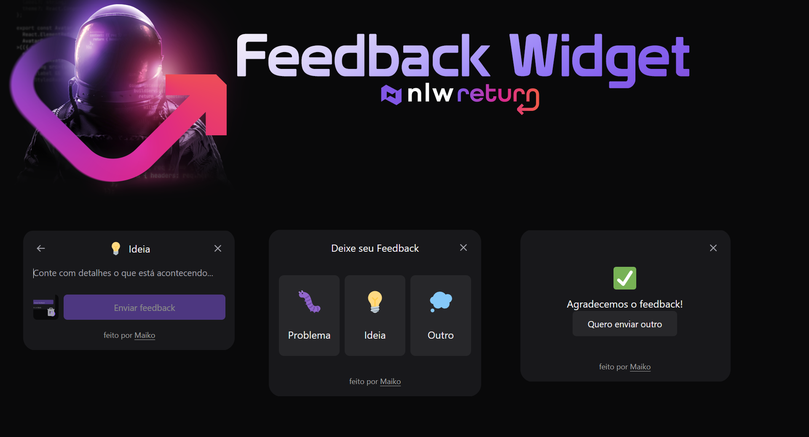

# Feedback-Widget-NodeJS

<h1 align="center">
  
</h1>

  <a href="#-tecnologias">Tecnologias</a>&nbsp;&nbsp;&nbsp;|&nbsp;&nbsp;&nbsp;
  <a href="#-projeto">Projeto</a>&nbsp;&nbsp;&nbsp;|&nbsp;&nbsp;&nbsp;
  <a href="#-como-executar">Como executar</a>&nbsp;&nbsp;&nbsp;|&nbsp;&nbsp;&nbsp;
  <a href="#iphone-demo-deploy">Demo</a>&nbsp;&nbsp;&nbsp;|&nbsp;&nbsp;&nbsp;
    <a href="#mailbox_with_no_mail-contatos">Contatos</a>&nbsp;&nbsp;&nbsp;|&nbsp;&nbsp;&nbsp;
  

    

 

 

  
 

## ✨ Tecnologias

Esse projeto foi desenvolvido com as seguintes tecnologias:

NodeJS

Prisma

## 💻 Projeto

No projeto Feedback Widget você escolhe o tipo de feedback, tira uma printscreen da tela e adiciona um comentário.

## 🚀 Como executar

- Clone o repositório
- Instale as dependências com `npm`
- Inicie o servidor com `npm run dev`

Agora você pode acessar [`localhost:3000`](http://localhost:3000) do seu navegador.

## :iphone: Demo: Deploy

A aplicação Web poderá ser acessada aqui: 

## :mailbox_with_no_mail: Contatos

Email: maiko.akagui.duarte@gmail.com  
Linkedin: www.linkedin.com/in/maiko-akagui-duarte-253649129
